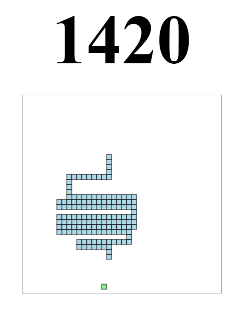

# EZ Snake Game

Ez Snake Game is just the snake game made completely in JavaScript. This will be used as reference code if you want to take a look at it and see how exactly I did it.

The game is played with the arrow keys and begins on load of page if the user presses the "P" key this will cause the game to pause and continue to play. I may tinker a bit to see if I can make a start button to where the game wont start unless the button has been pushed and the player is ready.

I used a resource to teach me more about how to make games in JS but specifically snake game which can be found [here](https://www.educative.io/blog/javascript-snake-game-tutorial) as well as a video that proved to be using less stable code but still was slightly helpful in learning [here](https://www.youtube.com/watch?v=9TcU2C1AACw&feature=emb_logo).

I learned a lot about using a canvas on HTML as well as using new methods in JS such as the getContext(), fillStyle, strokestyle, fillRect(), and fillStroke(). using these methods as well as others I was able to essentially "draw" on the HTML page inside the canvas. The snake is created out of an array which adds one to length if a bean has been eaten. The snake array creates a new head at the front of the snake and takes one away from the end of the array to give the appearance of moving on the screen. the main() function is called repeatedly in a setInterval() to constantly "re-draw" what is being viewd on the canvas. There is an eventlistener for the arrow keys which detects and depicts which direction the snake can and will go. All in all it was pretty cool to learn how! 

Please play around with it! A live deployement can be found [here](https://mrcartree.github.io/ez-snake-game/) on GitHub Pages. I hope you enjoy playing around!

This application was authored by [Zach LaFleur](https://github.com/MrCartree)